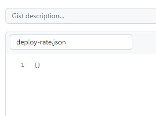
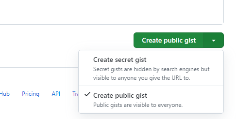

# Create badges for metrics output


One way of making metrics transparent is through badges to be displayed on pages by choice.

By using a fantastic small action: *Dynamic Badges Action* by `schneegans` you can create badges that change colour depending on value.

## What to do

### Create a gist file

In github, on your personal menu at the top right, select `Your gists`. Create a new gist by clicking the `+` top right.

Fill in *Filename including extension...* with `deploy-rate.json` and the content with an empty json `{}`:



When done, select *Create Public gist* at bottom right corner:



Note your gist url. Should lok something like:

```
https://gist.github.com/<user>/<gist id>
```

### Create a workflow

To populate the file in your gist, create a new workflow file and add to your repository:

```yaml
name: Create Badge on DevOps Metrics

on: 
  push:
  schedule:
  - cron: '30 0 * * *'

jobs:
  update-metrics:
    runs-on: ubuntu-latest
    name: Checking the dora metrics
    steps:
      - name: DevOps Metrics from GitHub
        uses: stenjo/devops-metrics-action@v0.3.1-beta
        id: dora
        with:
          owner: 'stenjo'
          repo: 'devops-metrics-action'
          token: ${{ secrets.GITHUB_TOKEN }}

      - name: Create the Badge
        uses: Schneegans/dynamic-badges-action@v1.6.0
        with:
          auth: ${{ secrets.GIST_AUTH_TOKEN }}
          gistID: <gist id>
          filename: deploy-rate.json
          label: Deploy Rate
          message: ${{ steps.dora.outputs.deploy-rate }} # Use the output from the `dora` step
          valColorRange: ${{ steps.dora.outputs.deploy-rate }} # Use the output from the `dora` step
          maxColorRange: 7
          minColorRange: 1
          invertColorRange: true
```

The above workflow needs access to your gist by a token. Take a look at [Dynamic Badges Action](https://github.com/marketplace/actions/dynamic-badges) for instructions how to do this.

### Display badge

In a markdown file (like this one) add this code to display your badge.

```

```
